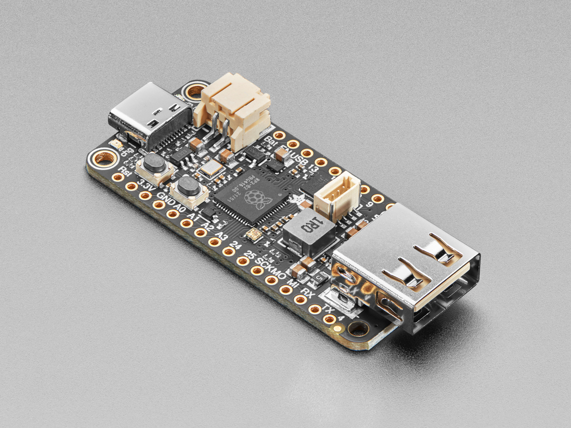

# OGX-Mini

Firmware for the RP2040/Pico, setup for the [Adafruit Feather USB Host board](https://www.adafruit.com/product/5723), capable of emulating gamepads for
- Original Xbox
- XInput (not Xbox 360)
- Nintendo Switch (must be in dock mode, no rumble yet)

Currently there's no way to switch what device is being emulated on the fly, so the firmware must be compiled specifically for whichever platform you'd like to play on. As long as that's the case, I'll provide compiled .uf2 files for each platform in [Releases](https://github.com/wiredopposite/OGX-Mini/releases).

# Supported devices
- Original Xbox Duke and S controllers
- Xbox One, Series, and Elite controllers
- Wired Xbox 360 controllers
- Xbox 360 wireless PC adapter (Microsoft or clones, syncs 1 controller)
- Sony Dualshock 4 (PS4) controllers
- Sony Dualsense (PS5) controllers
- 8Bitdo v1 and v2 Bluetooth adapters

# Adding supported controllers
I am currently searching for VID and PID numbers for PS3, PS4, PS5, and Switch Pro gamepads, including knockoffs. If you have one, let me know and I'll add support for it.

# Compiling
You can compile this for the Pi Pico by commenting out this line in CMakeLists.txt
`add_compile_definitions(FEATHER_RP2040)`
That will set the D+ and D- host pins to GPIO 0 and 1. Below that you can uncomment whichever platform (OG Xbox, Xinput, etc.) you'd like to use.

# Special thanks
Thank you to Ryzee119 and the Open Stick Community, without their work this project would not exist.