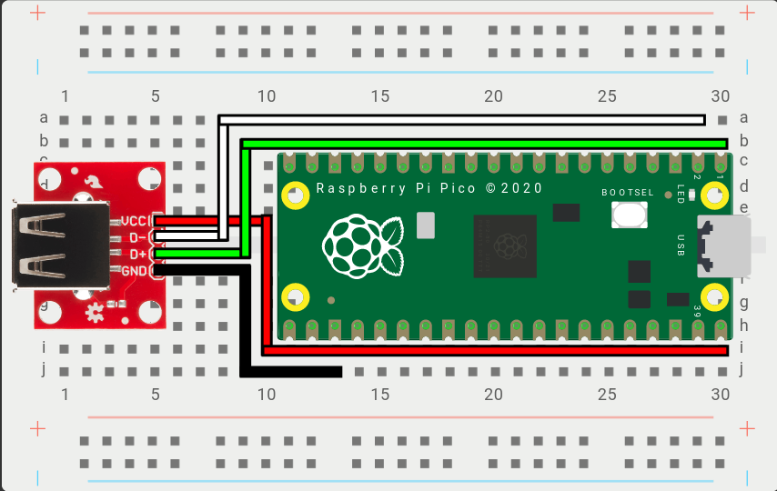

# OGX-Mini

Firmware for the RP2040, capable of emulating gamepads for several consoles. The firmware now comes in 3 flavors, for the [Adafruit Feather USB Host board](https://www.adafruit.com/product/5723), the Pi Pico, and the Waveshare RP2040-Zero.

## Supported platforms
- Original Xbox
- Playstation 3
- Nintendo Switch (docked)
- XInput (not Xbox 360)
- Playstation Classic

## Supported devices
### Wired controllers
- Original Xbox Duke and S
- Xbox 360, One, Series, and Elite
- Dualshock 3 (PS3)
- Dualshock 4 (PS4)
- Dualsense (PS5, Dualsense Edge should work but it's untested)
- Nintendo Switch Pro
- Nintendo Switch wired (tested with PowerA brand)
- Nintendo 64 USB (experimental, tested with RetroLink brand)
- Playstation Classic
- Generic DInput

### Wireless adapters
- Xbox 360 PC adapter (Microsoft or clones, syncs 1 controller)
- 8Bitdo v1 and v2 Bluetooth adapters (set to XInput mode)
- Most wireless adapters that present themselves as Switch/XInput/PlayStation controllers should work

Note: There are some third party controllers that can change their VID/PID, these might not work correctly.

## Changing input mode
By default the input mode is set to OG Xbox, you must hold a button combo for 3 seconds to change which platform you want to play on. Your chosen input mode will persist after powering off the device. 

Start = Plus (Switch) = Options (Dualsense/DS4)

### XInput
Start + Dpad Up 
### Original Xbox
Start + Dpad Right
### Switch
Start + Dpad Down
### PlayStation 3
Start + Dpad Left
### PlayStation Classic
Start + A (Cross for PlayStation and B for Switch gamepads)

After a new mode is stored, the RP2040 will reset itself so you don't need to unplug it. 

## Hardware
I've created an interposer board for the RP2040-Zero so you can make a small form-factor adapter yourself. The gerber files, schematic, and BOM are in Hardware folder.

If you would like a prebuilt unit, you can purchase one, with cable and Xbox adapter included, from my website [wiredopposite.com](https://wiredopposite.com/product/ogx-mini-controller-adapter-for-original-xbox-playstation-3-and-switch-ogx360/) or my [Etsy store](https://www.etsy.com/listing/1426992904/ogx-mini-controller-adapter-for-original).

For the Pi Pico, this is a diagram of how you'd connect the extra USB port:

For the [Adafruit Feather USB Host board](https://www.adafruit.com/product/5723), no extra work is needed.

## 2 & 4 Player support (in initial development)
With v0.4, 2 and 4 player variants of the firmware are included on the Releases page, this is only meant for PlayStation 3 and Nintendo Switch. You can use either a self-powered USB hub or an Xbox 360 wireless adapter to play with 4 controllers. 

As it is right now, the Switch/PS3 will see 2 or 4 controllers no matter how many you're using, but I'm currently working on a way to connect controllers as they're plugged in or synced with a wireless adapter.

## Adding supported controllers
If your third party controller isn't working, but the original version is listed above, send me the device's VID and PID and I'll add it so it's recognized properly.

## Compiling
You can compile this for different boards by changing USBD_BOARD in the usbd_config.h file, you can also adjust USBD_MAX_GAMEPADS to enable more controllers on Switch and PlayStation 3.

Choosing OGXM_PI_PICO will set the D+ and D- host pins to GPIO 0 and 1. 

You can also choose OGXM_RPZERO_INTERPOSER for the RP2040-Zero and that will set D+ and D- to GPIO 10 and 11, so connecting a USB port is easier. You can still use the Pi Pico firmware on the RP2040-Zero (the other way around has not been tested though).

## Special thanks
Thank you to Ryzee119 and the OpenStickCommunity, without their work this project would not exist.