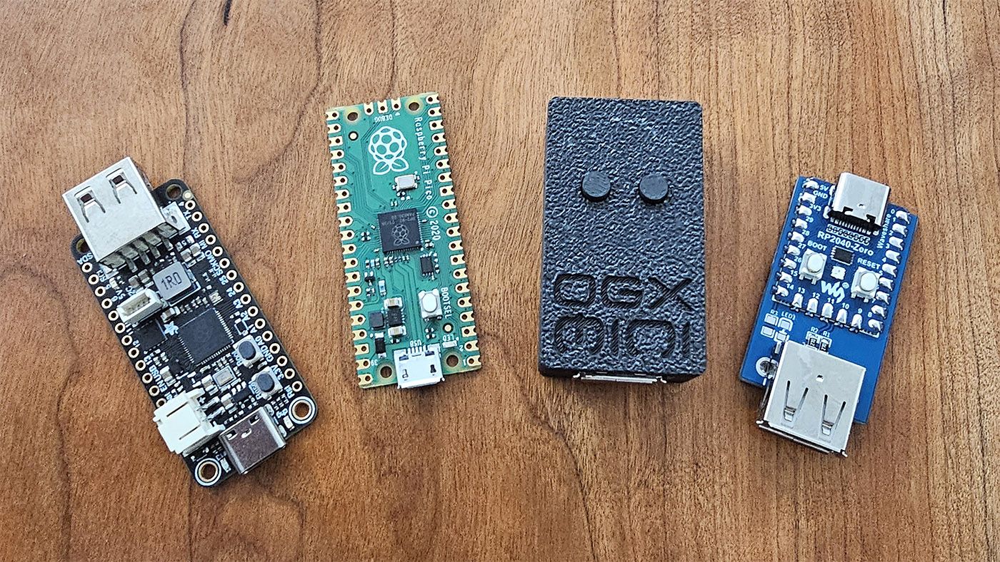

# OGX-Mini

Firmware for the RP2040, capable of emulating gamepads for several game consoles. The firmware comes in 6 flavors, the [Adafruit Feather USB Host board](https://www.adafruit.com/product/5723), Pi Pico, Waveshare RP2040-Zero, Pi Pico W, RP2040/ESP32 hybrid, and 4-Channel RP2040-Zero.

## Supported platforms
- Original Xbox
- Playstation 3
- Nintendo Switch (docked)
- XInput (use [UsbdSecPatch](https://github.com/InvoxiPlayGames/UsbdSecPatch) for Xbox 360)
- Playstation Classic

## Supported devices
### Wired controllers
- Original Xbox Duke and S
- Xbox 360, One, Series, and Elite
- Dualshock 3 (PS3)
- Dualshock 4 (PS4)
- Dualsense (PS5)
- Nintendo Switch Pro
- Nintendo Switch wired
- Nintendo 64 Generic USB
- Playstation Classic
- Generic DInput
- Generic HID (Limited)

Note: There are some third party controllers that can change their VID/PID, these might not work correctly.

### Wireless adapters
- Xbox 360 PC adapter (Microsoft or clones, syncs 1 controller)
- 8Bitdo v1 and v2 Bluetooth adapters (set to XInput mode)
- Most wireless adapters that present themselves as Switch/XInput/PlayStation controllers should work

### Wireless Bluetooth controllers (Pico W & ESP32)
Note: Bluetooth functionality is in early testing, some may have quirks.
- Xbox Series, One, and Elite 2
- Dualshock 3
- Dualshock 4
- Dualsense
- Switch Pro
- Steam
- Stadia
Please visit [this page](https://bluepad32.readthedocs.io/en/latest/supported_gamepads/) for a more comprehensive list of supported controllers.

## Changing input mode
By default the input mode is set to OG Xbox, you must hold a button combo for 3 seconds to change which platform you want to play on. Your chosen input mode will persist after powering off the device. 

Start = Plus (Switch) = Options (Dualsense/DS4)

- XInput
    - Start + Dpad Up 
- Original Xbox
    - Start + Dpad Right
- Switch
    - Start + Dpad Down
- PlayStation 3
    - Start + Dpad Left
- PlayStation Classic
    - Start + A (Cross for PlayStation and B for Switch gamepads)

After a new mode is stored, the RP2040 will reset itself so you don't need to unplug it. 

## Features new to v1.0.0
- Web application for configuring deadzones and buttons mappings, supports up to 8 saved configurations.
- Bluetooth functionality for the Pico W and ESP32 (in combination with an RP2040).
- 4 channel functionality, connect 4 Picos via I2C and use your Xbox 360 wireless adapter.
- Delayed USB mount until a controller is plugged in, useful for internal installation. 
- Generic HID controller support.
- Dualshock 3 emulation (minus gyros), rumble now works.
- Steel Battalion controller emulation with a wireless Xbox 360 chatpad.
- Xbox DVD dongle emulation, you must provide or dump your own firmware, see the Tools directory.
- Analog button support on OG Xbox and PS3.

## Hardware
For Pi Pico, RP2040-Zero, 4 channel, and ESP32 configurations, please see the hardware folder for diagrams.

I've designed a PCB for the RP2040-Zero so you can make a small form-factor adapter yourself. The gerber files, schematic, and BOM are in Hardware folder.

If you would like a prebuilt unit, you can purchase one, with cable and Xbox adapter included, from my [Etsy store](https://www.etsy.com/listing/1426992904/ogx-mini-controller-adapter-for-original).

## Adding supported controllers
If your third party controller isn't working, but the original version is listed above, send me the device's VID and PID and I'll add it so it's recognized properly.

## Compiling
You can compile this for different boards with CMake arguments while configuring the project.

Choosing OGXM_PI_PICO will set the D+ and D- host pins to GPIO 0 and 1. 

You can also choose OGXM_RPZERO_INTERPOSER for the RP2040-Zero and that will set D+ and D- to GPIO 10 and 11, so connecting a USB port is easier. You can still use the Pi Pico firmware on the RP2040-Zero (the other way around has not been tested though).