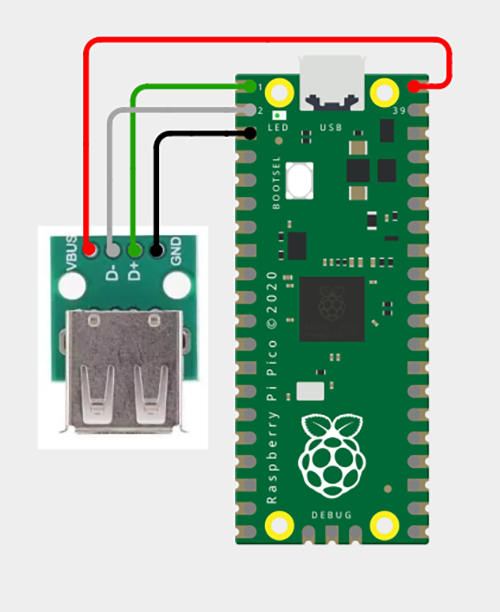
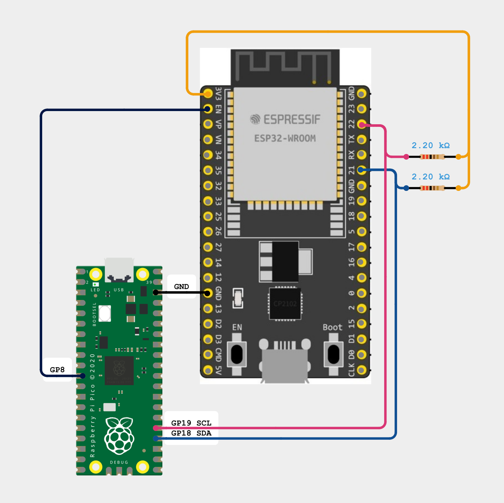
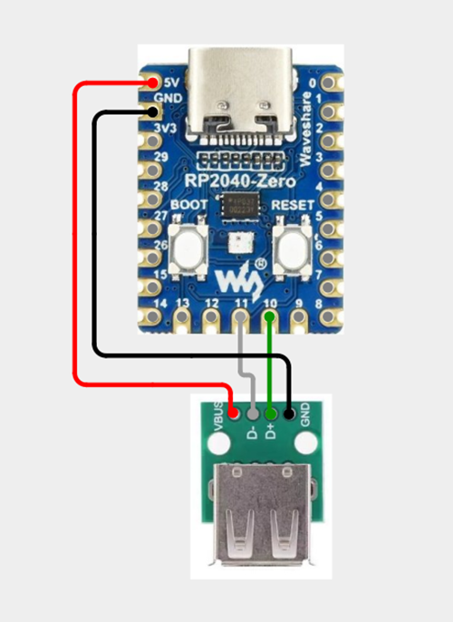

# Pi Pico

# Pi Pico 2
The Pico 2 will likely require 4.7k resistors between the USB data lines and ground to work correctly.

# Pi Pico + ESP32
This is the minumum amount of connections you'll want for this to work and the diagram assumes you're powering the Pico and ESP32 each separately via USB (do not connect power between the 2 boards if so). A more complex configuration is possible, making the Pi Pico able to program the ESP32, but I'll update the repo with that diagram later.

# RP2040-Zero

Gerber, BOM, and schematic for an RP2040-Zero interposer board you can make yourself. LED1 and R3 are both optional. 

The RP2040-Zero board can be found on Amazon and AliExpress.

